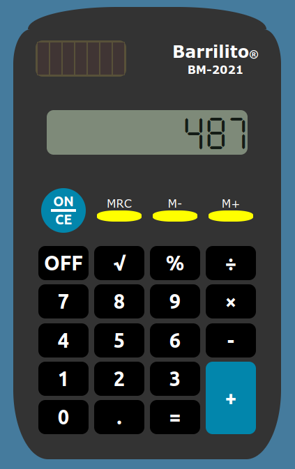

# Calculator

> Check de [demo here 🤖](https://filotaxis.github.io/Calculator/)

This was the final project of the fundamentals from the [Odin Project](https://www.theodinproject.com/paths/foundations/courses/foundations). 

The project consists on a basic calculator. In order to use it you have to turn it on, pressing the round teal button. I tried to replicate the design of the calculator that i used when i was younger

